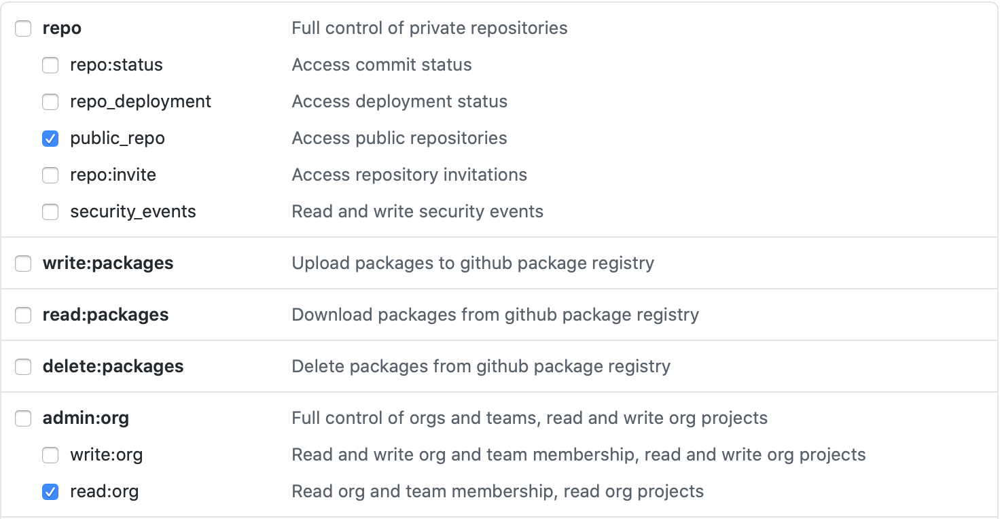

# conda-forge-contribution
[](https://travis-ci.com/jan-janssen/conda-forge-contribution)

This repository allows you to quickly generate a list of all your [conda-forge](https://conda-forge.org) contributions.

For example the contributions of [jan-janssen](https://github.com/jan-janssen) are available at [https://jan-janssen.github.io/conda-forge-contribution/](https://jan-janssen.github.io/conda-forge-contribution/).

To generate your own contribution-list, simply fork this repository and set the following variables for your [travis-ci.com](https://travis-ci.com) build environment:

```
USERNAME = <your Github username>
GH_TOKEN = <your Github token which enables access to public_repo and read:org>
```

For the token the following permissions are required:


Designed by [colorlib](https://colorlib.com/wp/template/responsive-table-v2/).
# List of Packages 

| Package Name | Downloads |
|:------------:|:---------:|
| [pika](https://anaconda.org/conda-forge/pika) | [](https://anaconda.org/conda-forge/pika) |
| [circus](https://anaconda.org/conda-forge/circus) | [](https://anaconda.org/conda-forge/circus) |
| [uritools](https://anaconda.org/conda-forge/uritools) | [](https://anaconda.org/conda-forge/uritools) |
| [frozendict](https://anaconda.org/conda-forge/frozendict) | [](https://anaconda.org/conda-forge/frozendict) |
| [aldjemy](https://anaconda.org/conda-forge/aldjemy) | [](https://anaconda.org/conda-forge/aldjemy) |
| [plumpy](https://anaconda.org/conda-forge/plumpy) | [](https://anaconda.org/conda-forge/plumpy) |
| [reentry](https://anaconda.org/conda-forge/reentry) | [](https://anaconda.org/conda-forge/reentry) |
| [kiwipy](https://anaconda.org/conda-forge/kiwipy) | [](https://anaconda.org/conda-forge/kiwipy) |
| [topika](https://anaconda.org/conda-forge/topika) | [](https://anaconda.org/conda-forge/topika) |
| [ete3](https://anaconda.org/conda-forge/ete3) | [](https://anaconda.org/conda-forge/ete3) |
| [aiida-core](https://anaconda.org/conda-forge/aiida-core) | [](https://anaconda.org/conda-forge/aiida-core) |
| [click_config_file](https://anaconda.org/conda-forge/click_config_file) | [](https://anaconda.org/conda-forge/click_config_file) |
| [cp2k](https://anaconda.org/conda-forge/cp2k) | [](https://anaconda.org/conda-forge/cp2k) |
| [qe](https://anaconda.org/conda-forge/qe) | [](https://anaconda.org/conda-forge/qe) |
| [pgsu](https://anaconda.org/conda-forge/pgsu) | [](https://anaconda.org/conda-forge/pgsu) |
| [zeopp-lsmo](https://anaconda.org/conda-forge/zeopp-lsmo) | [](https://anaconda.org/conda-forge/zeopp-lsmo) |
| [raspa2](https://anaconda.org/conda-forge/raspa2) | [](https://anaconda.org/conda-forge/raspa2) |
| [chargemol](https://anaconda.org/conda-forge/chargemol) | [](https://anaconda.org/conda-forge/chargemol) |
| [spfft](https://anaconda.org/conda-forge/spfft) | [](https://anaconda.org/conda-forge/spfft) |
| [spla](https://anaconda.org/conda-forge/spla) | [](https://anaconda.org/conda-forge/spla) |
| [sirius](https://anaconda.org/conda-forge/sirius) | [](https://anaconda.org/conda-forge/sirius) |
